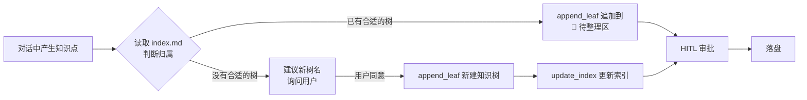
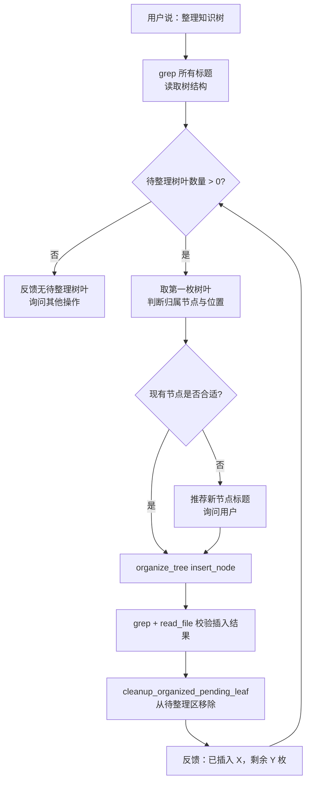

# knowledge-tree-deepagents
一个「把散落知识捋成自己的教程」的个人知识管理系统。在与AI的对话中收集零散知识（树叶），AI 自动归类到知识树，长期积累最终形成个人独有的知识体系。

## 一、这是什么

知识之树用 md 文件 + Deep Agent + Skill + HITL（人工审批）搭建了一套个人知识积累系统：

- **记叶子**：对话中聊到有价值的知识，一句话让 agent 整理成结构化的知识节点（树叶），存入"待整理"区
- **整理**：手动发起，把"待整理"区的树叶挂到知识树正确的分支上
- **建索引**：多棵知识树靠 index.md 索引管理，隔离各知识体系，防止单文件过大

核心隐喻：知识 = 树叶；归类挂枝 = 形成结构；看树找缺口 = 指引下一步学习。

---

## 二、技术栈

- **框架**：Deep Agents（LangGraph / LangChain）
- **检索**：DuckDuckGo 网页搜索 + requests+bs4 静态抓页
- **模型**：通过 `langchain-openai` 兼容接口接入（默认 DeepSeek，可在 `models.py` 中更换）
- **存储**：纯本地 Markdown 文件，无需数据库
- **交互**：LangGraph Studio（支持 HITL 人工审批）
- **环境管理**：uv（推荐）/ pip，Python >= 3.11

---

## 三、快速开始

### 1. 环境要求

- Python >= 3.11
- 一个可用的模型 API Key（默认使用 DeepSeek，见 `models.py`）
- 推荐用 [uv](https://docs.astral.sh/uv/) 管理环境（安装：`curl -LsSf https://astral.sh/uv/install.sh | sh`）

### 2. 安装依赖

#### 方式一：uv（推荐）

```bash
uv venv                                # 创建 .venv
uv pip install -r requirements.txt
uv pip install "langgraph-cli[inmem]"  # 本地启动 langgraph dev 所需
```

#### 方式二：pip

```bashx
python -m venv .venv
source .venv/bin/activate              # Windows: .venv\Scripts\activate

pip install -r requirements.txt
pip install "langgraph-cli[inmem]"
```

> `langgraph-cli[inmem]` 是**开发工具**，只用于本地起服务，因此没有写进 `requirements.txt`。

### 3. 配置环境变量

```bash
cp .env.example .env
```

编辑 `.env`，至少填入所使用的模型 Key（默认 DeepSeek）：

```dotenv
DEEPSEEK_API_KEY=sk-xxxxxxxxxxxxxxxx
```

> 如需更换模型，编辑 `models.py`，取消对应注释即可（Anthropic / OpenAI / Gemini / Groq / Ollama / Kimi / OpenRouter 等均已给出示例）。

### 4. 启动

用 uv（推荐，会自动使用当前目录的 `.venv`，无需手动激活）：

```bash
uv run langgraph dev
```

或用 pip：

```bash
source .venv/bin/activate              # Windows: .venv\Scripts\activate
langgraph dev
```

启动后，LangGraph 服务会监听本地 API（默认 `http://127.0.0.1:2024`）。注意：这个地址是 API，不是直接聊天的网页。

推荐使用 [AgentChat](https://agentchat.vercel.app/) 作为聊天界面：

1. 保持上面的 `langgraph dev` 进程运行；
2. 打开 <https://agentchat.vercel.app/>；
3. 在页面中将后端地址填写为 `http://127.0.0.1:2024`，然后连接并开始对话。

AgentChat 是部署在 Vercel 上的网页，访问它通常需要国际网络；但连接地址仍然是你本机的 LangGraph API，知识树文件不会因为使用该前端而上传到 AgentChat。

如果浏览器提示跨域或连接失败，可以先检查：浏览器和 `langgraph dev` 是否在同一台电脑上、服务是否仍运行，以及地址是否使用 `http://127.0.0.1:2024`（不要填 `https://`）。

LangGraph CLI 也可能打印一个 **Studio UI** 链接；它同样是可选的远程网页界面。若该页面无法访问，直接使用 AgentChat 或下面的替代方案即可。

### 5. 开始使用

```text
你： 帮我把刚才聊到的 Python 深拷贝记到知识树里
AI： （调用 append_leaf）已将《深拷贝与浅拷贝》追加到 python.md 的「🍂 待整理」区
     ⏸ 等待你审批 approve / edit / reject

你： 整理知识树
AI： （调用 organize_tree）已把「深拷贝与浅拷贝」插入到「# Python知识树 / ## 内存模型」下，
     还有 2 个待整理树叶……
```

---

## 四、目录结构

```text
knowledge-tree-deepagents/
├── agent.py              # 核心：工具定义 + graph 组装（langgraph.json 指向这里的 graph）
├── models.py             # 模型配置（默认 DeepSeek，可切换其他厂商）
├── langgraph.json        # LangGraph 入口配置
├── requirements.txt      # 依赖
├── skills/               # Agent Skills（渐进式披露的技能包）
│   ├── append-leaf/
│   │   ├── SKILL.md                       # 「记叶子」技能说明
│   │   └── references/
│   │       ├── index-example.md           # 索引文件样例
│   │       └── knowledge-tree-example.md  # 知识树样例
│   └── organize-tree/
│       └── SKILL.md                       # 「整理知识树」技能说明
├── knowledge-trees/      # 📚 你的知识树（运行时生成，不在版本库中）
│   ├── index.md          # 知识树索引
│   └── python.md         # 各主题知识树
└── memories/             # Agent 的默认工作区（虚拟文件系统落点）
```

---

## 五、核心工作流

### 5.1 记叶子（append-leaf）

在聊天中随手抛出一句"记一下"，agent 会把这段对话提炼成一枚结构化的树叶挂到待整理区。



要点：

- 树叶统一使用 **三级标题 + 日期** 格式：`### [2026/8/27] 深拷贝与浅拷贝`
- 提炼时倾向于写**通用知识**，剥离当前会话的私有背景；
- 但若你明确要求保留个人背景（生活感悟、心理疗愈类），agent 不会拒绝。

### 5.2 整理知识树（organize-tree）

手动发起，把待整理区的散叶挂到正确的"树枝"上。



要点：

- 插入正文时**自动去掉树叶标题里的日期**：`### [2026/8/27] 深拷贝与浅拷贝` → `### 深拷贝与浅拷贝`
- 需要新建分支时，在插入内容最前面加一行 `## 新节点标题` 即可；
- 整理完成后可以要求 agent 输出纯文本的树结构，或更新 `index.md` 里的主题介绍。

### 5.3 索引管理

`knowledge-trees/index.md` 是全局目录，多棵知识树靠它隔离，避免单文件无限膨胀：

```markdown
# 知识树索引

- [Python](./python.md) — Python、Deep Agents、软件工程
- [心理学](./psychology.md) — 执行功能、认知偏误、禅宗
```

每次新增知识树后，agent 会调用 `update_index` 覆盖式重写索引（会先读取现有内容再补齐）。

---

## 六、工具与技能

### 6.1 工具一览（定义在 `agent.py`）

| 工具 | 作用 | 是否需审批 |
| --- | --- | --- |
| `search_web(query, max_results)` | DuckDuckGo 联网搜索 | 否 |
| `fetch_webpage(url, max_length)` | 抓取网页正文（自动识别编码、去噪） | 否 |
| `get_current_date()` | 返回当前日期 `YYYY/MM/DD` | 否 |
| `append_leaf(path, tree_name, content)` | 追加树叶到知识树「待整理」区，文件不存在则新建 | ✅ approve / edit / reject |
| `organize_tree(path, op, anchor, insert_at, content, source_heading)` | 插入新节点 / 移动节点 | ✅ approve / edit / reject |
| `cleanup_organized_pending_leaf(path, leaf_heading)` | 从待整理区移除已整理的树叶 | ✅ approve / reject |
| `update_index(content)` | 覆盖式更新索引文件 | ✅ approve / edit / reject |

`organize_tree` 的两种模式：

- `insert_node`：在锚点节点内容的最前（`start`）或最末（`end`）插入内容；
- `move_node`：把 `source_heading` 节点整体移动到 `anchor` 节点下（注意 `anchor` 不能是 `source_heading` 的子节点）。

### 6.2 技能（Skills）

技能是**按需加载**的说明书，模型只在识别到对应意图时才读入，从而节省上下文：

| 技能 | 触发条件 | 使用的工具 |
| --- | --- | --- |
| `append-leaf` | 用户说"记录 / 保存 / 加到知识树 / 记一下" | `get_current_date`、`append_leaf`、`update_index` |
| `organize-tree` | 用户说"整理知识树" | `grep`、`read_file`、`organize_tree`、`cleanup_organized_pending_leaf`、`update_index` |

---

## 七、文件系统与安全设计

Agent 看到的是一套**虚拟文件系统**，通过 `CompositeBackend` 把不同前缀路由到本地真实目录：

| 虚拟路径 | 实际目录 | 权限 |
| --- | --- | --- |
| `/knowledge-trees/` | `./knowledge-trees` | 只读（写操作被 deny，只能走工具） |
| `/skills/` | `./skills` | 只读（写操作被 deny） |
| 其他路径 | `./memories`（默认区） | 可读写 |

这样设计的好处：

- **结构受控**：知识树的写入必须经过 `append_leaf` / `organize_tree` 等工具，工具内部会校验标题层级、维护「待整理」边界，不会把树改乱；
- **目录穿越防护**：所有工具都会把 `path` 解析成绝对路径并校验是否落在 `./knowledge-trees` 内，拒绝绝对路径与 `../` 遍历；
- **审批兜底**：即使工具被调用，也要经过 HITL 才能生效。

---

## 八、知识树的文件约定

一棵知识树就是一个普通 Markdown 文件，靠标题层级表达结构：

```markdown
# Python知识树

## 内存模型
### 深拷贝与浅拷贝
（正文……）

## 包管理
### uv 与 pip 的区别
（正文……）

## 🍂 待整理
### [2026/8/27] Python 文件写入模式：'w' 与 'a' 的区别
（正文……）
```

| 层级 | 含义 |
| --- | --- |
| `# 标题` | 知识树根节点 |
| `## 标题` | 主分支（领域） |
| `### 标题` | 树叶（具体知识点） |
| `## 🍂 待整理` | 未归类树叶的暂存区，固定名称，不要改名 |

> ⚠️ 不要手动修改「🍂 待整理」这一行文字，工具依赖它来定位暂存区边界。

---

## 九、常见问题

**Q：AI 会把我的知识树改坏吗？**
不会。直接写文件已被权限拒绝，写入只能通过工具完成；所有修改知识树的工具调用还需要你审批。

**Q：知识树文件很大，会不会撑爆上下文？**
技能里已经约束 agent 优先用 `grep` 定位标题，再按需 `read_file` 局部读取，避免整篇加载。

**Q：我想换模型怎么办？**
编辑 `models.py`，注释掉当前 `model` 定义、取消你想要的那一行注释即可。

**Q：为什么必须在本项目根目录下启动 `langgraph dev`？**
`agent.py` 里的 `WORKDIR`、`SKILLS_DIR` 是相对路径（`./knowledge-trees`、`./skills`），`langgraph.json` 中的 `dependencies: ["."]` 也以配置所在目录为基准。在项目根目录启动才能正确找到知识树和技能包。`uv run langgraph dev` 同样要在项目根目录执行。

**Q：国际网络不可用时，AgentChat 还有什么替代方案？**
可以按下面的优先级选择：

1. 使用 LangGraph CLI 输出的 Studio UI 链接；如果该服务也无法访问，则使用本地前端。
2. 在本地运行一个兼容 LangGraph API 的开源聊天前端（例如 LangChain 的 `agent-chat-ui`），让前端连接 `http://127.0.0.1:2024`。这样聊天界面和 agent 都在本机，不依赖 `agentchat.vercel.app`。
3. 不使用图形界面，直接调用本地 API：打开 `http://127.0.0.1:2024/docs` 查看接口文档，或使用 LangGraph 的 Python/JavaScript SDK 编写一个极简命令行客户端。这种方式最不依赖网络，但模型服务本身仍需要能访问对应的模型 API。

注意：无论使用哪种聊天界面，`langgraph dev` 都必须保持运行；`localhost` 只能被当前电脑访问，不能直接作为公网地址分享给其他人。

**Q：用 uv 的话，每次都要先 `source .venv/bin/activate` 吗？**
不需要。`uv run` 会自动使用当前目录下的 `.venv`，直接在项目根目录执行 `uv run langgraph dev` 即可；`uv pip install` 默认也会装进这个 `.venv`，无需手动激活。

**Q：全新克隆后没有 `knowledge-trees/` 目录，需要手动建吗？**
不需要。这两个目录被 `.gitignore` 排除（属于你的私有数据，不进版本库），首次「记叶子」时 `append_leaf` 会自动创建 `knowledge-trees/`；`update_index` 同样会自动创建目录。想手动建也可以：

```bash
mkdir -p knowledge-trees
```

**Q：数据会上传吗？**
知识树文件全部保存在本地 `./knowledge-trees`，只有对话内容会发给模型服务商。

---

## 十、说明

知识树天然是长出来的：一开始只有零星几片叶子，用得越久，分支越密。等你某天发现某个分支翻来覆去就那么几片叶子——那正是该去学点新东西的地方。

## License

见 [LICENSE](./LICENSE)。
